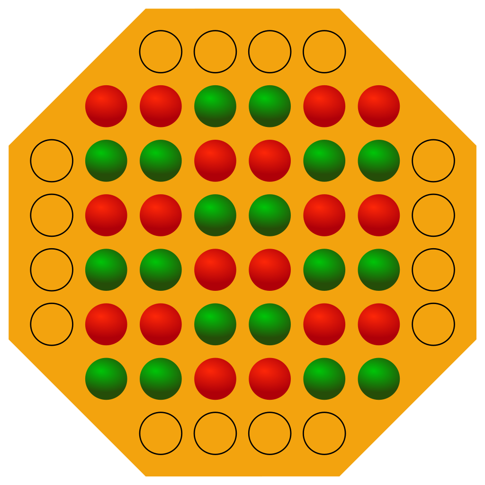

# FocusGame

Focus is a two-player strategy board game. Players have colored pieces that move around the board. An image of the board at the game's start is below, where Player One is playing Red, and Player Two is playing Green. My implementation of the board omits the four 1x4 extensions around the edges, for simplicity (leaving only the 6x6 board in the center for gameplay).

## Quick summary of the rules:
**Making a move:** Stacks may move as many spaces as there are pieces in the stack. Players may only move a stack if the topmost piece in the stack is one of their pieces. When a stack lands on top of another stack, the two stacks merge.\
\
**Reserving and capturing pieces:** If the new stack contains more than five pieces, then pieces are removed from the bottom to bring it down to five. If a player's own piece is removed, they are kept in that player's "reserve". If an opponent's piece is removed, it has been "captured".\
\
**Making a reserved move:** Pieces from a player's "reserve" may be placed on the board later in lieu of moving a stack.\
\
**How to win:** The first player to capture 6 of the other player's pieces is the winner.\

### What's in these files:

* **FocusGame.py:** The Player, Space, and FocusGame classes that are used to run the game. Users do not have any interactions with the Player and Space classes, as these are only used to encapsulate player actions. The methods in the FocusGame class that are used by the player are _move_piece, show_pieces, show_captured, show_reserve,_ and _reserve_move._ 
* **game.py:** This is an example of how the FocusGame library is used to play a real game. All game commands are wrapped by a _print()_ statement so that the status messages returned by the FocusGame methods can be viewed.
